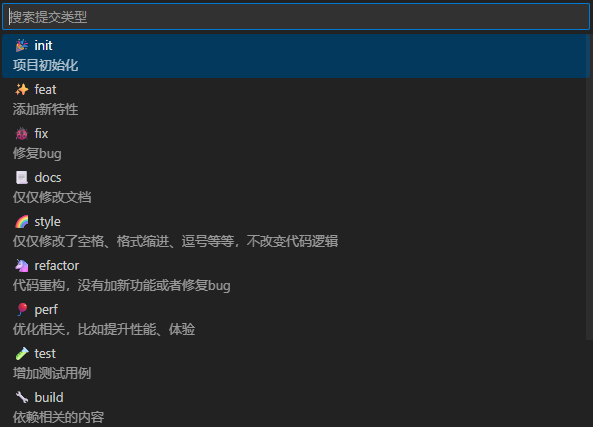
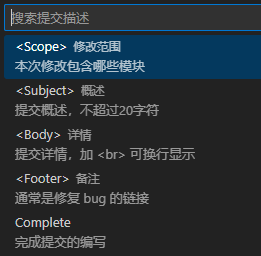
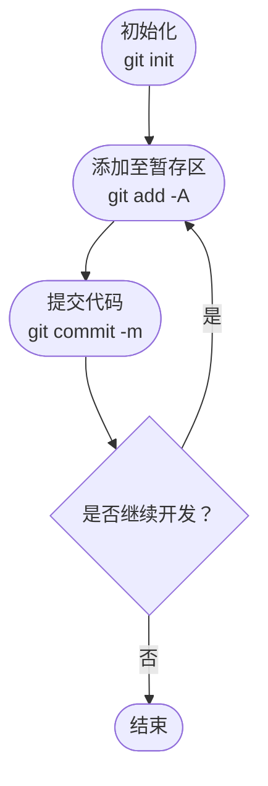
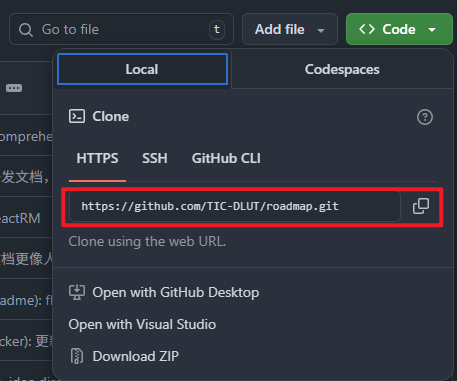

# Git 快速入门教程 🚀

## Git 介绍

Git 是什么？Git 和 Github 的关系是什么？这份教程带你快速入门 ✈️

Git 是目前世界上最先进的分布式版本控制系统！
大白话：自动帮你管理你的项目版本，让你快速回溯某个版本。

Github 是全球最大的软件开源平台，你可以将你的代码上传到这个 Github 上，供你自己或者他人一起学习/工作使用。
在 Github 上有很多非常有意思的项目，欢迎大家的探索 🔍

## Git 安装 ⬇️

官网: https://git-scm.com/

Windows 用户下载安装文件双击运行，后续操作直接默认即可

MacOS 和 Linux 可以通过包安装 git

```bash
# MacOS
brew install git
# Debian/Ubuntu
apt-get install git
```

安装完 git 之后你还需要配置用户名和邮箱

```bash
git config --global user.name "hello-git"
git config --global user.email "123456@example.com"
```

## Git 基础 📖

### 初始化和提交

进入你的项目中，执行`git init`来初始化你的 git 仓库。
此时在你的项目下会自动生成隐藏文件夹 📂.git，这个文件夹不需要我们手动管理。

现在你可以开始添加/删除/修改你的代码文件...Coding💻。

当你完成某个阶段性任务后，现在我们要进行代码版本记录，方便后续的版本回溯。

- `git add -A`（-A 表示**所有文件**添加到**暂存区**）。
- `git add [filename]`添加**单独的文件**到暂存区
- `git commit -m [描述性文字]`。这里的描述性文字要写清楚你这个阶段做了什么，比如`git commit -m "feat: login-register"`。

> PS: 在 VS Code 里可以使用*git-commit-plugin*扩展插件 🧩 来规范 commit 的写法
>  > 

流程图：



相关命令

```bash
# 初始化
git init

# 添加至暂存区
git add -A

# 提交你的代码
git commit -m "init/feat/refactor/fix/docs...: "
```

至此，你已经学会了 git 的大部分基础！通常来说这是我们最常用的命令之三。如果不出现 ❌⚠️ 的话你可以先查看[远端仓库](##远端仓库)的内容。

### 仓库状态的查看

- `git status`查看当前仓库的状态。
- `git log`查看仓库所有的 commit 日志信息，加上`--pretty=oneline`参数可以只显示一行日志信息。

### 远端仓库

先在 Github 注册账号，在 Github 点击右上角加号 ➕ 然后点击**New repository**创建一个新仓库，填好名字，其他设置默认即可。（默认创建 Public 仓库，注意不要上传隐私数据）。

在 Github 打开**空仓库**时可以看到**https 链接**或者**ssh 链接**，形如：`https://github.com/aimmetal-tech/git-test.git`，或者点击绿色的 Code 下拉按钮可以看到。



为本地仓库添加远程源

- `git remote add origin [🔗https链接]`

在添加远程源后执行

- `git push -u origin main`这句话的意思是将本地 main 分支推送到远程仓库，main 分支通常是默认分支。
- `-u`表示 upstream，这会把本地 main 分支和上游远程仓库的 main 分支关联起来，这样之后再 push 的时候就不需要指定分支了，只需直接执行`git push`。

克隆仓库

- `git clone [仓库链接 🔗]`
  当你克隆仓库后 git 会自动关联远程仓库，后续推送仓库直接`git push`即可

### 分支管理

创建新分支

- `git branch [分支名称]`

切换分支

- `git checkout [分支名称]`

或者可以使用

- `git checkout -b [分支名称]`来创建并切换分支

当创建新分支后，如果我们想 push 到远程仓库上我们要先执行`git push -u origin [分支名称]`，因为此时远程仓库还没有这个分支。执行完后续只需`git push`

#### 合并操作

```bash
git checkout [需要合并的分支] # 如main
git merge [需要被合并的分支]  # 如dev
```

若遇到冲突只需在解决冲突后再提交一个commit即可

#### PULL REQUEST

俗称pr

pr有两个作用：合并自己仓库的两个分支，
以及多人协作

我们通常用pr进行多人协作

比如先fork别人的仓库到自己名下，然后clone到本地修改，再push到远程仓库，接着创建一个pr，等待原仓库管理者审核通过后合并功能。

#### STASH

当你正在某个分支工作时突然要转到另一个分支，
此时可以通过
`git stash`保存当前分支工作进度，然后转向另一个分支。

当工作完成后回到原先的分支执行
`git stash pop`即可恢复工作进度

### 标签TAG 

给当前commit打上标签
`git tag [标签名]` 标签名一般为版本号，如v1.0.1

推送所有本地标签
`git push --tags`

推送某一个标签

`git push origin v1.0.1`

## Github进阶

### Release发布

使用 GitHub 的 **Release 功能**可以让你在项目中发布构建好的二进制文件，例如：

- Windows：`.exe`
- Android：`.apk`
- Linux：`.AppImage` / `.deb`
- macOS：`.dmg` / `.app`
- 任何构建后的产物：`.zip`、`.tar.gz` 等

### Github Actions

GitHub Actions 是 GitHub 内置的 **CI/CD 自动化平台**，可以用它来执行：

- 自动构建你的项目（编译 C++、Go、Flutter、Node 等）
- 自动运行测试
- 自动生成产物（例如编译生成 `.exe`，`.apk`）

### Github Pages

GitHub Pages 用来托管**静态网站**，例如：

- 个人主页或博客
- 项目文档
- API 文档生成页面
- 前端应用（Vue/React/Next.js 静态导出）